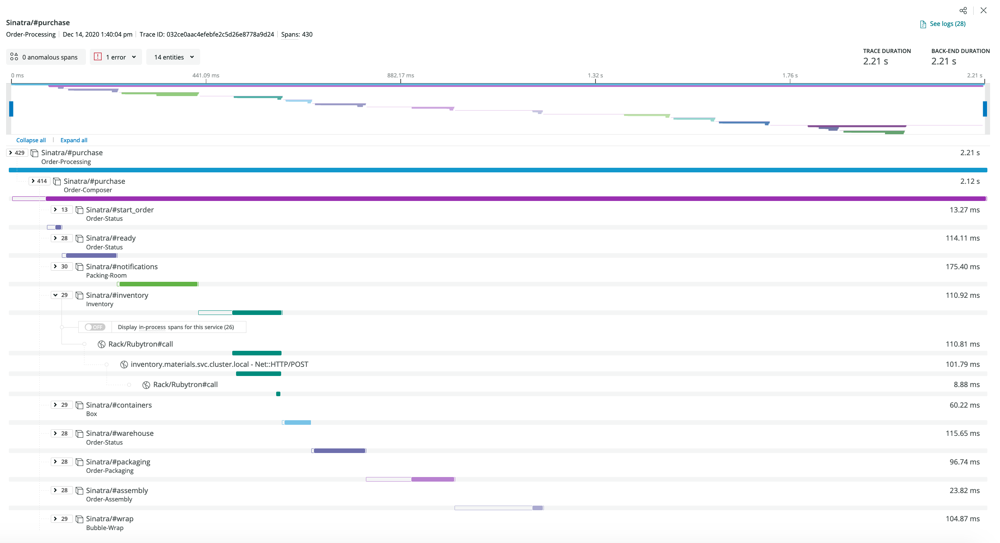
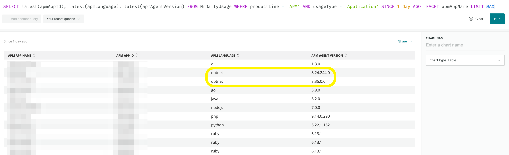
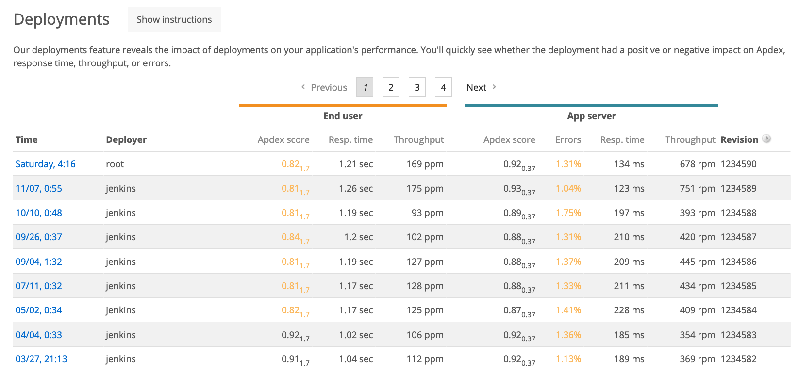

| |[Home](/MD/readme.md)	| [Product Summary](/MD/product-summary.md) |[Account General](/MD/Account/Account.md)	| [Users & Roles](/MD/Account/UsersAndRoles.md) | [Programmability](/MD/Account/Programmability.md)	|  [Automation](/MD/Account/Automation.md) | [APM Lambda](/MD/Products/APMLambda.md) |
|:---:	|:---:	|:---:	|:---:	|:---:	|:---:	|:---:	|:---:	|
|Products	|[APM](/MD/Products/APM.md) |[Browser](/MD/Products/Browser.md)| [Synthetics](/MD/Products/Synthetics.md) |[Insights](/MD/Products/Insights.md) |[Alerts](/MD/Products/Alerts.md) | [Infrastructure](/MD/Products/Infrastructure.md) | [Logs](/MD/Products/Logs.md) |

# New Relic Handbook

# New Relic APM Best Practices

## Application Naming Schema
Having a naming convention can add clarity in responsibility, geographical location, or purpose. Here is an example of a possible naming convention: "[team name] - [service name] - [environment]". Some teams also use braces for the environment instead of the last dash. Some examples: 

```shell
myapplication - frontend - aws-dublin
myapplication - frontend - aws-us-east
myhub - loginservice -  aws-us-east
```

Note that the full name should stay below 42 characters or otherwise it will be cut off in the New Relic web UI.
In order to aggregate multiple entries (i.e. for being able to display statistics for regions separately but also for all regions application) you can define multiple name with a semicolon as the separator. Please keep in mind that a name duplication or triplication will have an impact on ingested data volume. Example:
Defining two applications with 

```shell
myapplication - frontend - aws-all;myapplication - frontend - aws-dublin
myapplication - frontend - aws-all;myapplication - frontend - aws-us-east
```

will create the following three entries in New Relic: 

```shell
myapplication - frontend - aws-dublin
myapplication - frontend - aws-us-east
myapplication - frontend - aws-all (aggregation of the previous two applications)
```

---

## Tags / Labels
Tags or labels add an additional layer of searchability within New Relic. Ensure you utilise appropriate tags for your applications, specifically with regard to Region, and Environment. Examples below.

> _Environment: Production_

> _Region: EU_

With tags like this, you can both filter to the applications that matter to you in the index page, and you can also bulk target alerts by tag, to capture your entire environment with the same conditions. The alerts configured using tags as the targeted approach will also be dynamic. This means if a new services reports in tagged with a tag that matches something targeted with an alert, it will automatically be added to that alert condition.

You can add Tags in 4 ways
1. [THE APM UI](https://docs.newrelic.com/docs/using-new-relic/user-interface-functions/organize-your-data/labels-categories-organize-apps-monitors)
2. [The Tagging API](https://docs.newrelic.com/docs/apis/nerdgraph/examples/nerdgraph-tagging-api-tutorial)
3. [The REST API](api.newrelic.com)
4. [APM Agent Configuration File](https://docs.newrelic.com/docs/using-new-relic/user-interface-functions/organize-your-data/labels-categories-organize-apps-monitors)

Tagging should be a habit for each new service or application reporting in. 

---

## Agent Configuration
Please ensure the following attributes are set appropriately in your agent configuration file. NOTE: The Syntax below is accurate for the Java APM agent, please be sure to follow the [appropriate syntax](https://docs.newrelic.com/docs/agents/manage-apm-agents/configuration/configure-agent#agent-config) if you utilise a different language agent.

The absolute minimum is setting `app_name` and `license_key` - Everything else will fall to a sane default. 

* `app_name = My Application`
* `license_key = xxxxxxxxxxxx`
* `distributed_tracing:
       enabled: true`
* `enable_auto_transaction_naming: true`
* `record_sql: obfuscated`

You can get your license key from your account settings page: https://rpm.newrelic.com/accounts/{your_account_id}

Some config parameters specifically worth looking at are:
* `attributes.include:` by default we do not collect any request parameters (for data protection reasons). However, some of those might be interesting from a technical or business perspective and could be added using this option

* `enable_auto_transaction_naming:` typically, the default app and transaction naming algorithm is pretty accurate. However, sometimes it is worth looking at this if for instance all transactions are accumulated under a central controller-type transaction (single entry point into your application). In this case it might make sense to disable this option and
look at the [transaction naming protocol](https://docs.newrelic.com/docs/agents/java-agent/instrumentation/transaction-naming-protocol).

* `distributed_tracing:` distributed tracing lets you see the path that a request takes as it travels through a distributed system. This is particularly interesting for micro service architectures that consist of a large number of services that are difficult to udnerstand in an isolated view.

---

## Distributed Tracing
While you are in the process of deciding how to configure your New Relic APM Agent. It is worth considering as you roll this out, turning on Distributed Tracing for all your services. This will ensure that if you have a distributed type of architecture with several applications talking to each other, New Relic will be able to trace requests from service to service.

More details on Distributed Tracing and the powerful visual it provides in troubleshooting distributed systems can be found here -> [Intro To Distributed Tracing](https://docs.newrelic.com/docs/understand-dependencies/distributed-tracing/get-started/introduction-distributed-tracing)

[Steps to Enable per APM Agent](https://docs.newrelic.com/docs/understand-dependencies/distributed-tracing/enable-configure/enable-distributed-tracing)

[Steps to Enable for New Relic Browser](https://docs.newrelic.com/docs/browser/new-relic-browser/browser-pro-features/browser-data-distributed-tracing)

Here's an an examplary overview of a distributed trace in a demo environment of New Relic:



---

## Keep your applications up to date
Please keep your application agents up to date. New Relic regularly releases new features and bug fixes through new agent versions. You can verify your APM agent versions with this NRQL query:

```sql
SELECT latest(apmAppId), latest(apmLanguage), latest(apmAgentVersion) FROM NrDailyUsage WHERE productLine = 'APM' AND usageType = 'Application' SINCE 1 day AGO  FACET apmAppName LIMIT MAX
```

You can easily spot agent version drifts in your current rollout:



Alternatively, you can add a `Nerdpack` - a UI extension written in React - that offers a better graphical overview as well as capabilities around keeping your New Relic agents up to date: [Groundskeeper](https://one.nr/0nVjYD7YNR0)

---

## Deployment Markers
Deployment Markers are crucial to understanding the performance impact your deployments have. You should include a detailed Changelog/Description and if your deployment tool supports it use variables to inject key information about who is making deployments.

* [New Relic Docs for Recording Deployments.](https://docs.newrelic.com/docs/apm/new-relic-apm/maintenance/record-monitor-deployments)

Another option for extra information if working to configure deployment markers using post deployment hooks, you can also add a similar call for extra deployment that your tool processes and success or fail, send data to New Relic insights as a custom event and this will allow you to take in key information about how often you have successful deploys, when it fails what the reasons for failure were and help you optimise these processes. 

Jenkins Deployment Notifier: https://plugins.jenkins.io/newrelic-deployment-notifier/

Jenkins Example Plugin: https://wiki.jenkins.io/display/JENKINS/New+Relic+Insights+Plugin

Send Custom Event Data to Insights: https://docs.newrelic.com/docs/insights/insights-data-sources/custom-data/send-custom-events-event-api

In the `Deployments` section in `APM` you will get an overview of performance changes of your past deployed versions. Here's an an examplary overview of an application in the demo environment of New Relic:



Sending Deployment Markers will also grant access to the [Deployment Analyzer](https://one.nr/0eqwyDAx1Qn) `Nerdpack` which gives you a more graphical overview of your performance changes and for more than a single application.

---

## Key Transactions
Basic New Relic APM Monitoring is great, however if you need to track the performance of individual transactions, utilising Key Transactions is the best way. It is recommended that you use Key Transactions to track your slowest transactions while you perform changes to boost the performance of these transactions. You should ensure you are alerting on these transactions, and have an appropriate Apdex Threshold configured for these.

* [New Relic Docs for Key Transactions](https://docs.newrelic.com/docs/apm/transactions/key-transactions/introduction-key-transactions)

Key transactions are grouped together in the [New Relic UI](https://one.nr/06vjAoLBzwP), so they are easy to find and examine. Regardless of which application they are reporting from. 

You can set a custom Apdex threshold for a key transaction. The benefit of this is that if the transaction is slower than a normal performance for your application (perhaps doing heavy lifting and expected to perform slower), the custom apdex will ensure this transaction being naturally slow doesn't impact your Apdex score. 

It also means that for this transaction New Relic will only capture Transaction Traces when transaction response time is 4x slower than your Apdex T setting for this Key Transactions. This ensures that naturally slower transactions do not domainate your transaction traces and allow transaction which are normally quite fast, trigger transaction traces when they degrade. 
Similarly if you have extremely quick transactions you can set a lower Apdex T setting to match it's normal performance and get traces at appropriate times. 

You can set an alert policy for a key transaction. Typically each application has transactions that are pivotal or key to their exitance and functionality. Wrapping these transactions in alerts is best practice to ensure if critical paths in your applications degrade, you are the first to know.

Adding key transactions should be balanced so that you don’t have too few (probably not meaningful enough data) or too many (information overload).

---

## Create Custom Transaction Attributes / Custom Span Attributes / Custom Events
New Relic APM agents provide API functions to utilise within your codebase to better control your monitoring. As such we also allow you to tag on additional information at runtime to enhance the data reported to New Relic. 

An overview of each langague agent's capabilities and functions can be found here: https://docs.newrelic.com/docs/using-new-relic/data/customize-data/collect-custom-attributes

### Custom Transaction Attributes
This will allow you to tag information that may be important when troubleshooting onto the transaction as it's happening. You could tag ecommerce cart data, dynamically or manually entered values, the ID of a store or terminal, something only known at runtime and tag it to the dataset New Relic reports up for that Transaction. 

This will then be something you can use to filter your data or add context to something in features like
* `Error Analytics and Traces`
* `Transaction Traces`
* `Insights Event Data` (Every APM Request is 1 Transaction, every transaction sends key/value pair data as a row in an event table, custom attributes tags this information to that data, making it useful when building dashboards).

This can be achieved by using the Java agent's `NewRelic.addCustomParameter();` functionality:

```java
  const service = 'carcontrol';
  // set it as a custom Transaction attribute delivered to New Relic
  NewRelic.addCustomParameter("service", service);
```

### Custom Span Attributes
It may be required that you record more than a single custom value of the same kind (e.g. when looping through an Array) and a single value for the above `service` is not enough. In these cases, you can add an individual custom value to `service` to each Span instead of only one for an entire Transaction.

This can be achieved by using the Java agent's `NewRelic.getAgent().getTracedMethod().addCustomAttribute();` functionality:

```java
  const service = 'carcontrol';
  // set it as a custom Span attribute delivered to New Relic
  NewRelic.getAgent().getTracedMethod().addCustomAttribute("service", service);
```

### Custom Events
At times, appending business relevant information to pre-existing functional data may not be the right way to go and you prefer writing dedicated `Events` into New Relic's database.

There are a [few ways](https://docs.newrelic.com/docs/insights/event-data-sources/custom-events) how you can report custom Events but we'll focus on the option available with the APM agent. An overview on language agent specific methods can be found here: https://docs.newrelic.com/docs/insights/event-data-sources/custom-events/apm-report-custom-events

This can be achieved by using the Java agent's `NewRelic.getAgent().getInsights().recordCustomEvent();` functionality:

```java
  Map<String, Object> eventAttributes = new HashMap<String, Object>();
  // set it as a custom Event delivered to New Relic
  NewRelic.getAgent().getInsights().recordCustomEvent("MyCustomEvent", eventAttributes);
```

---

## Create and evaluate alert policies
Alerting is critical to ensure you are not reactive to issues and move into being pro-active in knowing about and solving issues in your applications.

Alert Policies should be created with WHO will be notified in mind. If a particular team is responsible for a group of services. A policy should be created with these team members as notification channels, perhaps use their team Slack channel or any incident management software for escalating alerts.

Conditions targeting each application should cover some basic KPI's. 
* `Response Time`
* `Throughput`
* `Error Rate`

Alerts on Response Time or Throughput could potentially make use of New Relic's Baseline alert type which evaluates current data versus what is typical for this metric at this time of day on this day of week. Making these metrics candidates for [baseline alerting](https://docs.newrelic.com/docs/alerts/new-relic-alerts/defining-conditions/create-baseline-alert-conditions). 

It may also be worth alerting on JMX metric to ensure full awareness of performance in your JVMs especially if you've configured additional JMX instrumentation.

Alert policies, conditions, and channels can also be managed using a configuration management solution such as Terraform for which New Relic exists as a provider: https://registry.terraform.io/providers/newrelic/newrelic/latest/docs

---

## Additional Best Practices
see also: https://docs.newrelic.com/docs/apm/new-relic-apm/guides/new-relic-apm-best-practices-guide

* Leverage New Relic’s reporting capabilities
  - Scalability Reports help understand app performance, database performance and CPU usage as requests scale up.
  - SLA reports help with reporting high level performance upwards to management
 
* Start troubleshooting errors using error analytics
  - Unhandled exceptions in your applications are automatically reported for easy deep diving and resolving.

* Look at your environment holistically
  - Understand how your applications communicates upstream and downstream among your distributed architecture.

* Enable role-based access (RBAC) and single sign-on (SSO)
  - RBAC allows you control access for each user on your account
  - SSO helps simplify creation of accounts linking with your AUTH provider.

* Improve Transaction reporting
  - Setting an appropriate Apdex T value for each application has a functional impact, in the sense that in influences for which Transaction we collect high level metrics or deep analysis of the entire transaction chain. To reduce the time required to find appropriate Apdex T values for each application, you can leverage our `Nerdpack` [Apdex Optimizer](https://github.com/newrelic/nr1-apdex-optimizer).

---

# Questions And Answers
**How to collect details about the external service?**

All New Relic agents collect information about external service calls. If you are not seeing these calls you can potentially use an Agent API function to instrument it as an external call. New Relic will automatically try to create a link between the service making the call and the service receiving and processing the call if both are monitored in New Relic. This will manifest in links in the UI in trace details and also as part of the Distributed Tracing view.

**Why should you care about Apdex score (Apdex T)?**

Whether you are setting an Apdex for your overall Application or an Apdex for your Key Transactions, you should consider two things when determining what to set your Apdex T.

1. When would I want to get a detailed trace for this transaction.
2. When would I want the performance of this transaction to impact my Apdex score overall.

If a transaction is typically 100ms, you may not want a trace at 200ms, but may want it to count as a degredation of Apdex as the transaction is performing below typical performance. An Apdex T of 150ms means that transactions performing up to 150ms will still report as a perfect Apdex score. Anything slower than 150ms will start to degrade your Apdex score. Any transaction between 150ms and 600ms will only get a half point toward your Apdex score. Anything slower than 600ms will get 0 points towards your Apdex score and will trigger a transaction trace to be recorded. Any transaction with an error gets 0 points towards your Apdex. 

So degraded performance over your Apdex T and transactions with errors will mean impacting your Apdex score. So if you use Apdex to alert, either on that transaction or the overall application. You know that an alert for Apdex will be meaningful as you set an Apdex that is typical for expected performance and alert when degraded performance is scaling in volume.

**How to setup a SLA reporting per external Service?**

Best practice for SLA reporting on external services is to set-up a Synthetic monitor for each external service. SLA report per monitor/external service will then be available OOTB in Synthetics
 
**What is the utilization overhead due to monitoring, due to different configuration?**

By default, we try to keep the overhead as low as possible. We ensure this by smart implementations of our agents (buffering of information, sending data when app is not busy, minimizing traffic and compressing data, etc.). In addition to that our agent’s configuration is also tuned to balance insights for your apps and overhead. All agents allow for deeper instrumentation by customizing the configuration and also sending additional information.

In the Java agent, if your application is looking like resource exhaustion. It will limit instrumentation to ensure New Relic is not a cause of a downtime due to over-instrumentation adding some overhead. 

https://docs.newrelic.com/docs/agents/java-agent/custom-instrumentation/circuit-breaker-java-custom-instrumentation

It is worth noting that monitoring is work, and as developers you know the more work a script has to do, the long it will take. As such monitoring is no different and the laws of physics still apply. If a transaction has thousands of database or external calls and each have to be timed. Even a very fast call to time a method (perhaps this timing call takes 0.0001 seconds) will start to create an overhead if it has to be called 10,000 times (potentially a 1 second overhead in this 10,000 methods to time example). 

The point being, instrument and time what you need, not everything. If you find gaps, instrument them as required and this will limit the potential impact to almost imperceivable.

**Can we use our own trace id? Any Insight about the trace id?**

Older New Relic agents use a method called Cross Application Tracing ([CAT](https://docs.newrelic.com/docs/apm/transactions/cross-application-traces/introduction-cross-application-traces)) in order to link transactions between APM apps.

Recent New Relic agents generate a Distributed Tracing payload and pass this from service to service in order to built a picture of a Trace through a Distributed system. This has a TraceID contained within.

For CAT we create our own randomly-generated string named tripID, For Distributed Tracing we generate a payload that contains information about parent and children for building this picture. From a business perspective it probably makes sense to add your own business correlation ID to each application/transaction in New Relic. This is especially important if you also track this trace ID in external services or applications that are not being monitored with New Relic.

This presents all New Relic customers with two options in this regard. You can ask our agent for the Distributed Tracing payload when a request starts and then pass this to other services manually yourself.
Or
You can grab your own TraceID and tag it to the New Relic Transaction data for correlation separately. New Relic's own traceID will still be stored and used by New Relic but your own traceID will be tagged alongside that data.
 
**Is it possible to notify one Deployment more than one time. e.g. at the spin up of the AMI?**

Yes, one deployment can be notified within New Relic multiple times. Our deployment tracking is actually very flexible is does not need to be tightly aligned to a step within the CI/CD pipeline. Basically, it is really just a REST API call that could be initiated from many different places in all different kind of steps, even including the initiation of an AMI.

---

| |[Home](/MD/readme.md)	| [Product Summary](/MD/product-summary.md) |[Account General](/MD/Account/Account.md)	| [Users & Roles](/MD/Account/UsersAndRoles.md) | [Programmability](/MD/Account/Programmability.md)	|  [Automation](/MD/Account/Automation.md) | [APM Lambda](/MD/Products/APMLambda.md) |
|:---:	|:---:	|:---:	|:---:	|:---:	|:---:	|:---:	|:---:	|
|Products	|[APM](/MD/Products/APM.md) |[Browser](/MD/Products/Browser.md)| [Synthetics](/MD/Products/Synthetics.md) |[Insights](/MD/Products/Insights.md) |[Alerts](/MD/Products/Alerts.md) | [Infrastructure](/MD/Products/Infrastructure.md) | [Logs](/MD/Products/Logs.md) |
